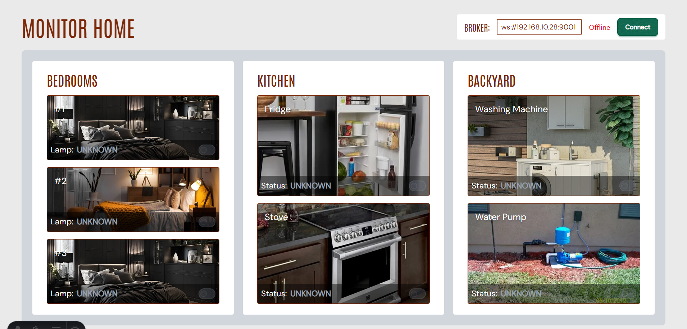
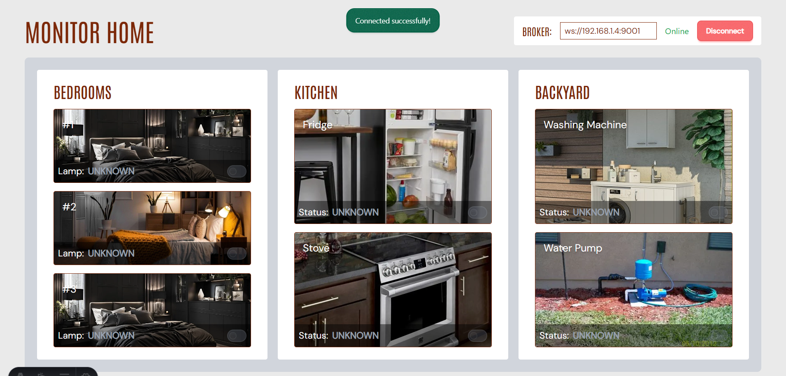
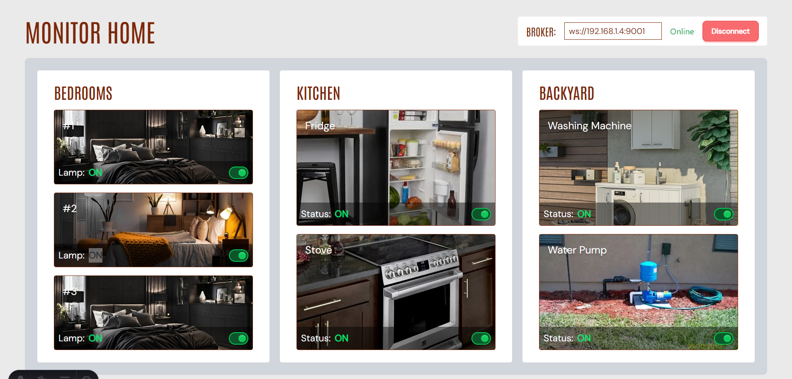
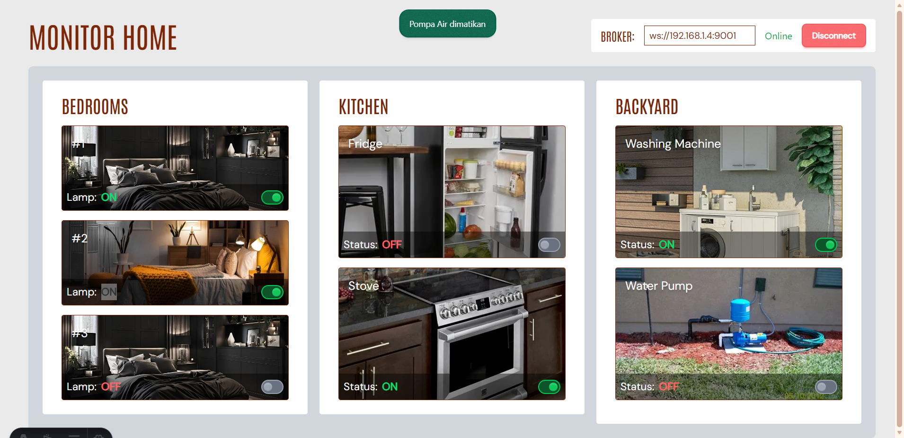
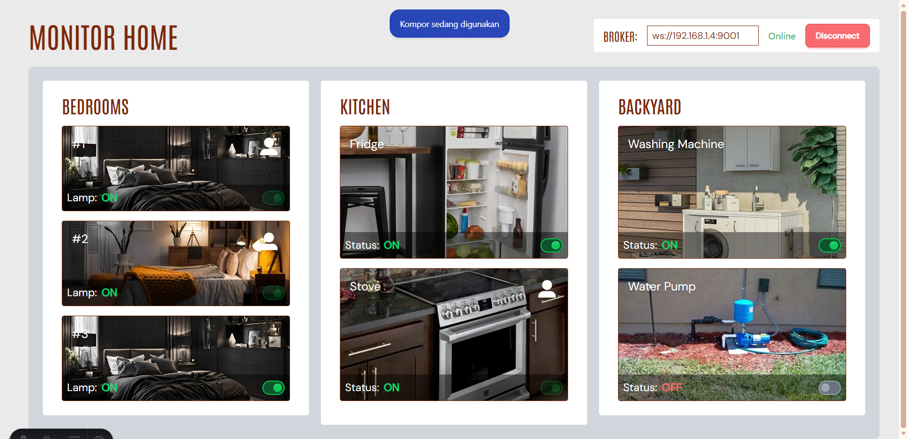
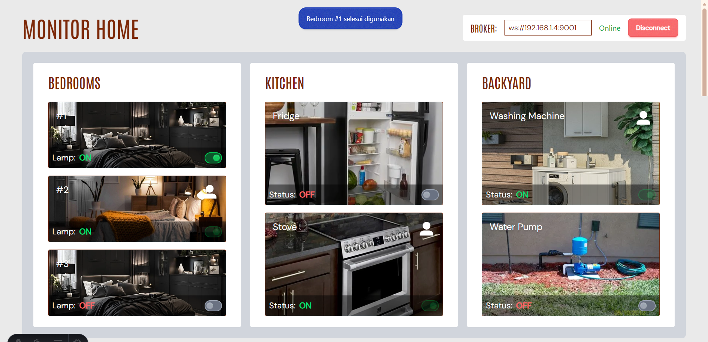

# Monitor Home - IoT 

## a. Judul dan ringkasan cara kerja Sistem
**Home Monitor – IoT Based Smart Home Monitoring System**

Projek ini merupakan sistem *monitoring* dan kontrol rumah berbasis **Internet of Things (IoT)** yang digunakan untuk memantau serta mengendalikan perangkat di berbagai ruangan rumah secara ***real-time*** melalui dashboard web.

Sistem ini bekerja mengikuti alur sebagai berikut:
1. Perangkat **IoT** (lampu kamar, kulkas, kompor, mesin cuci, dan pompa air) terhubung ke jaringan WiFi dan MQTT Broker.
2. Setiap perangkat melakukan ***publish*** status perangkat dan status okupansi ke topik MQTT tertentu.
3. Dashboard web melakukan ***subscribe*** ke topik-topik tersebut untuk menampilkan kondisi perangkat secara real-time.
4. Saat pengguna mengontrol perangkat melalui dashboard, data akan dikirim dengan ***publish*** ke topik MQTT `set`.
5. Perangkat IoT menerima data dan mengubah kondisi perangkat (ON/OFF) serta  mengirimkan kembali status terbaru ke MQTT Broker.

Dengan arsitektur ini, projek *Home Monitor* memungkinkan pemantauan dan pengendalian ruangan rumah yang terinstal perangkat-perangkat IoT.

## b. *Hardware* dan *Software* / *tools* yang digunakan
### *Hardware*
- Mikrokontroler IoT (**ESP8266 / ESP32**)
- Relay Module (untuk mengontrol perangkat listrik)
- Sensor okupansi (PIR Sensor atau simulasi status okupansi)
- Router atau Jaringan WiFi
- Kabel jumper dan power supply

### *Software* / *Tools*
- **Arduino IDE**  
  Digunakan untuk menulis dan mengunggah kode `.ino` ke perangkat IoT.
- **MQTT Broker (Mosquitto)**  
  Sebagai server atau perantara komunikasi data antar perangkat dan dashboard.
- **Frontend *Framework***
  - Astro
  - React
  - Tailwind CSS
- **MQTT over WebSocket**  
 Digunakan agar dashboard web (Astro + React) dapat berkomunikasi dengan MQTT Broker melalui browser.  
  Contoh rupa URL broker WebSocket:
  ```text
  ws://192.168.12.95:9001
- **Node.js & npm**  
  Untuk mengelola dan menjalankan dependensi frontend.
- **Visual Studio Code**  
  *Code editor* untuk pengembangan frontend dan dokumentasi.
- **Git**  
  *Version control system* untuk pengelolaan *source code*.

## c. Gambar rangkaian (wiring diagram)
> **Placeholder:** Gambar wiring diagram akan ditambahkan di sini.  
> Diagram ini akan menunjukkan koneksi antara mikrokontroler (ESP32/ESP8266), relay, sensor okupansi, dan perangkat listrik (lampu, kulkas, kompor, mesin cuci, pompa air).


## d. Gambar arsitektur aplikasi dan jaringan komputer  

### Struktur Frontend (Astro + React)

> **Placeholder:** Diagram arsitektur aplikasi akan ditambahkan di sini.  
> Diagram ini akan menunjukkan alur komunikasi MQTT antara perangkat IoT, MQTT Broker (Mosquitto), dan dashboard web (Astro + React), serta koneksi melalui WebSocket.


Catatan:
File dan folder yang tidak ditampilkan di bawah **tidak digunakan** dalam pembahasan proyek ini.

Struktur frontend untuk proyek Home Monitor adalah sebagai berikut:

```text
├── client/
│   ├── public/
│   │   └── img/
│   │
│   ├── src/
│   │   ├── mqtt/
│   │   │   └── mqttClient.js
│   │   ├── pages/
│   │   │   └── landing/
│   │   │       └── rooms/
│   │   │           ├── Backyard.jsx
│   │   │           ├── Bedrooms.jsx
│   │   │           └── Kitchen.jsx
│   │   └── App.jsx
│   │
│   ├── package.json
│   └── astro.config.mjs


```

### Struktur Kode Perangkat (.ino)

Struktur kode perangkat IoT untuk proyek Home Monitor adalah sebagai berikut:

```text
├── devices/
│   ├── bedrooms/
│   │   ├── bedroom_one.ino
│   │   ├── bedroom_two.ino
│   │   └── bedroom_three.ino
│   │
│   ├── kitchen/
│   │   ├── fridge.ino
│   │   └── stove.ino
│   │
│   ├── backyard/
│   │   ├── washing_machine.ino
│   │   └── water_pump.ino
│   │
```

## e. Topik & Payload MQTT

Pada proyek **Home Monitor**, komunikasi antara perangkat IoT dan dashboard dilakukan menggunakan protokol **MQTT**.
Setiap ruangan dan perangkat memiliki topik MQTT masing-masing untuk proses **publish** dan **subscribe** data.

Sistem ini terbagi menjadi **3 area utama**, yaitu:
- Bedrooms
- Kitchen
- Backyard

Setiap topik menggunakan payload boolean berupa `ON` dan `OFF` untuk merepresentasikan kondisi perangkat dan status okupansi tiap ruangan.

---

<details>
<summary><strong>🏠 Bedrooms</strong></summary>

Area Bedrooms terdiri dari **3 kamar tidur**: `one`, `two`, dan `three`.
Setiap kamar memiliki satu lampu dan satu status okupansi.

### Lamp Kamar Tidur
| Topic | Payload | Keterangan |
|------|--------|------------|
| `home/bedrooms/one/lamp/status` | `ON` / `OFF` | Status lampu kamar, dashboard **subscribe langsung** ke topic ini |
| `home/bedrooms/one/lamp/set` | `ON` / `OFF` | Perintah menyalakan/mematikan lampu |
| `home/bedrooms/one/occupancy` | `ON` / `OFF` | Status okupansi kamar, dashboard **subscribe langsung** ke topic ini |


</details>

---

<details>
<summary><strong>🍳 Kitchen</strong></summary>

Area Kitchen memiliki **2 perangkat**, yaitu kulkas (Fridge) dan kompor (Stove).
Masing-masing perangkat memiliki topik untuk status, perintah, dan okupansi.

### Fridge (Kulkas)
| Topic | Payload | Keterangan |
|------|--------|------------|
| `home/kitchen/fridge/status` | `ON` / `OFF` | Status kulkas |
| `home/kitchen/fridge/set` | `ON` / `OFF` | Perintah menyalakan atau mematikan kulkas |
| `home/kitchen/fridge/occupancy` | `ON` / `OFF` | Status penggunaan kulkas |

### Stove (Kompor)
| Topic | Payload | Keterangan |
|------|--------|------------|
| `home/kitchen/stove/status` | `ON` / `OFF` | Status kompor |
| `home/kitchen/stove/set` | `ON` / `OFF` | Perintah menyalakan atau mematikan kompor |
| `home/kitchen/stove/occupancy` | `ON` / `OFF` | Status penggunaan kompor |

</details>

---

<details>
<summary><strong>🌿 Backyard</strong></summary>

Area Backyard terdiri dari **2 perangkat** dan **1 status okupansi area**.
Perangkat yang digunakan adalah mesin cuci dan pompa air.

### Washing Machine (Mesin Cuci)
| Topic | Payload | Keterangan |
|------|--------|------------|
| `home/backyard/wm/status` | `ON` / `OFF` | Status mesin cuci |
| `home/backyard/wm/set` | `ON` / `OFF` | Perintah menyalakan atau mematikan mesin cuci |
| `home/backyard/wm/occupancy` | `ON` / `OFF` | Status penggunaan mesin cuci |

### Water Pump (Pompa Air)
| Topic | Payload | Keterangan |
|------|--------|------------|
| `home/backyard/pump/status` | `ON` / `OFF` | Status pompa air |
| `home/backyard/pump/set` | `ON` / `OFF` | Perintah menyalakan atau mematikan pompa air |
| `home/backyard/pump/occupancy` | `ON` / `OFF` | Status penggunaan pompa air |

### Backyard Area
| Topic | Payload | Keterangan |
|------|--------|------------|
| `home/backyard/occupancy` | `ON` / `OFF` | Status okupansi area backyard |

</details>


## f. Cara Instalasi

### 1. Instalasi MQTT Broker (Mosquitto)
Unduh dan instal Mosquitto dari situs resmi:  https://mosquitto.org/download/

Jalankan broker untuk memastikan Mosquitto berjalan:
```sh
mosquitto -v
```

### 2. Setup Arduino IDE
Unduh dan instal Arduino IDE: 
https://www.arduino.cc/en/software

Buka file .ino yang sesuai dengan perangkat, lalu sesuaikan konfigurasi WiFi dan alamat MQTT Broker.
Upload kode ke perangkat IoT menggunakan Arduino IDE.

### 3. Git Clone Repository 
```sh
git clone <URL_REPOSITORY>
```
### 4. Frontend Dependencies
Masuk ke direktori frontend, lalu install dependensi:
```sh
cd client
npm install
```
Jalankan frontend dashboard:
```sh
npm run dev
```


## g. Cara pengoperasian dan pengujian
### 1. Jalankan beberapa commans di vscode untuk bagian frontend:

| Command                   | Action                                           |
| :------------------------ | :----------------------------------------------- |
| `npm install`             | Menginstal dependencies                            |
| `npm run dev`             | Menyalakan dashboard frontend      |

### 2. Nyalakan server mqtt di cmd dengan command:

| Command                   | Action                                           |
| :------------------------ | :----------------------------------------------- |
| `cd "C:\Program Files\mosquitto`             | path di mana Anda menginstal mosquitto                            |
| `mosquitto -v`             | Menyalakan server mqtt      |

### 3. Jika server sudah menyala, maka gunakan broker URL yang sesuai dan hubungkan via dashboard

| Command | Action |
| :------------------------ | :----------------------------------------------- |
| `ipconfig` | Jalankan di CMD untuk mengetahui IPv4 Address komputer yang digunakan |
| `ws://192.168.6.50:9001` | Broker URL (contoh) |

Keterangan:
- `192.168.6.50` adalah IPv4 Address komputer yang menjalankan MQTT Broker.
  IPv4 Address dapat berbeda pada setiap pengguna, sesuaikan dengan hasil `ipconfig`.
- `9001` adalah port WebSocket MQTT Broker dan dapat berbeda tergantung konfigurasi broker.
- Format umum Broker URL:
  ws://<IPv4_ADDRESS>:<PORT>

### 4. Pengujian Pengiriman Data MQTT

Jika perangkat IoT sudah tersedia, pengujian dapat dilakukan langsung melalui perangkat.
Jika perangkat **belum dibuat**, pengujian dapat dilakukan menggunakan **CMD** dengan Mosquitto sebagai berikut;

| Command | Action |
| :------------------------ | :----------------------------------------------- |
| `cd "C:\Program Files\mosquitto"` | Masuk ke direktori instalasi Mosquitto |
| `mosquitto -v` | Menjalankan MQTT Broker |

Setelah broker berjalan, lakukan pengujian sebagai berikut.

Subscribe (mendengarkan semua topik):
```sh
mosquitto_sub -h <IPV4_ADDRESS> -p <PORT> -t "home/#" -v
```

Publish (mengirim data ke topik):
```sh
mosquitto_pub -h <IPV4_ADDRESS> -p <PORT> -t "<TOPIC>" -m "<PAYLOAD>"
```

Contoh pengujian:

Menyalakan status mesin cuci:
```mosquitto_pub -h 192.168.10.28 -p 1884 -t "home/backyard/wm/status" -m "ON"```

Mensimulasikan penggunaan mesin cuci:
```mosquitto_pub -h 192.168.10.28 -p 1884 -t "home/backyard/wm/occupancy" -m "ON"```


## i. Foto Perangkat

> **Placeholder:** Foto perangkat IoT akan ditambahkan di sini.  
> Foto ini akan menampilkan perangkat seperti lampu, kulkas, kompor, mesin cuci, pompa air, dan mikrokontroler yang digunakan.


## ii. Tangkapan layar dashhboard
### 1. Dashboard Awal (Belum Terhubung MQTT)
> Tampilan dashboard saat pertama kali dibuka sebelum dihubungkan ke MQTT Broker.



---

### 2. Dashboard Saat Terhubung MQTT
> Tampilan dashboard menampilkan status perangkat dan kontrol ON/OFF secara real-time setelah berhasil terhubung ke MQTT Broker.



---

### 3. Dashboard ketika Perangkat IoT Online 
> Tampilan dashboard menunjukkan perangkat IoT dalam kondisi **online** dan siap dimonitor secara real-time.  
> Pengguna juga dapat **mengendalikan perangkat** melalui dashboard, misalnya menyalakan atau mematikan lampu dan alat listrik lainnya.




---

### 4. Dashboard ketika Perangkat IoT Offline
> Tampilan dashboard menunjukkan perangkat IoT dalam kondisi **offline**.  
> Hal ini bisa terjadi karena **perangkat mati** atau **tidak terhubung ke jaringan/MQTT Broker**, sehingga kontrol dari dashboard sementara tidak dapat digunakan.



---

### 5. Dashboard Saat Ruang Terisi Penghuni
> Menampilkan bahwa terdapat **orang di ruangan**.  
> Ikon pengguna akan muncul di dashboard, dan **kontrol perangkat dinonaktifkan** selama ruangan masih terisi. Contohnya saat kompor sedang digunakan.



---

### 6. Dashboard Saat Ruang Kosong Penghuni
> Menampilkan bahwa ruangan **sudah tidak digunakan**.  
> Ikon pengguna hilang, dan **kontrol perangkat dapat digunakan kembali** dari dashboard.



---

